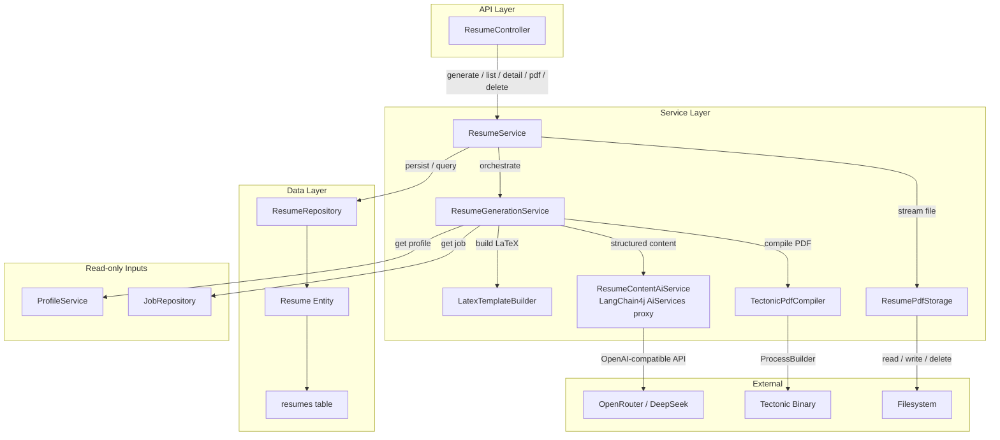
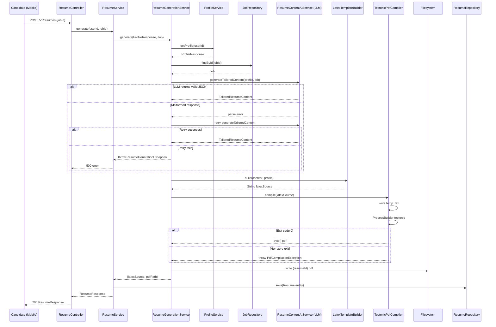
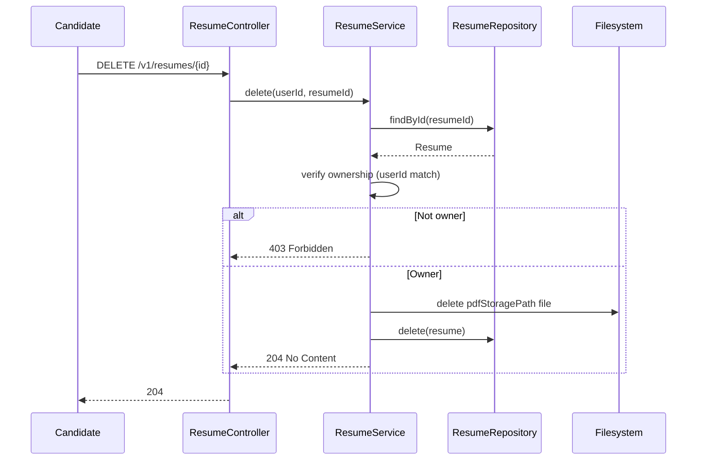

# Design Document

---
**Purpose**: Provide sufficient detail to ensure implementation consistency across different implementers, preventing interpretation drift.

---

## Overview

**Purpose**: This feature delivers AI-tailored PDF resume generation to candidates. Instead of applying to jobs in-platform, a candidate generates a job-specific resume that highlights their most relevant skills and experiences based on the job's requirements.

**Users**: Job candidates use the REST API (via the mobile app) to generate, list, download, and delete tailored resumes. The API orchestrates an LLM call, LaTeX template filling, and tectonic PDF compilation.

**Impact**: Replaces the entire Application subsystem (entity, controller, service, event, DTOs, table) with a Resume generation pipeline. Removes `applicationsCount` from `ProfileResponse` (adjacent impact on mobile/admin consumers).

### Goals
- Enable candidates to generate a polished, job-tailored PDF resume from their profile data + job requirements.
- Separate LLM content generation (structured JSON) from LaTeX rendering (deterministic Java template builder) for reliability.
- Fully remove the Application system and its database table.
- Integrate LangChain4j core deps (not starter) on Spring Boot 3.3.5 via manual bean wiring.

### Non-Goals
- Multiple resume templates (single fixed template).
- Async generation with progress streaming (synchronous for academic scope).
- Resume editing post-generation (regenerate instead).
- Spring Boot upgrade.
- Mobile UI changes (deferred to `mobile-resume-experience` spec).

## Boundary Commitments

### This Spec Owns
- The entire resume generation pipeline: LLM call → structured content → LaTeX template → tectonic PDF → storage.
- The `Resume` entity, `resumes` table, `ResumeRepository`.
- The `ResumeController` and all resume DTOs.
- The `service/resume/generate/` package (generation service, LaTeX builder, PDF compiler, LLM interface).
- The `config/LangChain4jConfig` bean wiring.
- The removal of all Application-related code and the `applications` table.
- The removal of `applicationsCount` from `ProfileResponse` and the `ApplicationRepository` reference in `ProfileService`.
- The `start.sh` / `.env.example` / `application.yml` changes for LLM and tectonic configuration.

### Out of Boundary
- Mobile UI for resume browsing/generation/preview (Spec: `mobile-resume-experience`).
- Job external URL field (Spec: `job-external-url`).
- Profile data model changes (profile is read-only input via `ProfileService`).
- Existing CV analyzer modifications (`ResumeAnalyzer`, `PdfTextExtractor` stay untouched).
- Recruiter/admin UI changes (admin loses application tracking — academic scope).
- Changes to `NotificationService` beyond removing the application-status method if unused.

### Allowed Dependencies
- `ProfileService.getProfile(userId)` → `ProfileResponse` (read-only input).
- `JobRepository` / `JobService` → `Job` entity (read-only input).
- `UserRepository` → candidate lookup.
- LangChain4j core libraries (`langchain4j`, `langchain4j-open-ai`).
- Tectonic binary (external process, configurable path).
- Filesystem for PDF storage.

### Revalidation Triggers
- `ProfileResponse` shape change (removal of `applicationsCount`) → mobile/admin consumers must re-check.
- `resumes` table schema change → migration consumers must re-check.
- Resume API contract change (`ResumeResponse` / `ResumeDetailResponse`) → `mobile-resume-experience` must re-check.
- `JobResponse` shape change (by `job-external-url` spec) → no impact on generation (reads `Job` entity directly).

## Architecture

### Existing Architecture Analysis
- The API follows a strict layered architecture: `controller/v1` → `service` → `repository` → `model`. DTOs are Java records in `dto/request` and `dto/response`. Entities use Lombok `@Data` + `@Builder`. Mappers are static utility classes in `service/mapper`.
- `PerfectJobApplication` has `@EnableSpringDataWebSupport(VIA_DTO)` — `Page<T>` returns DTOs, never entities.
- The `service/resume/` package already exists (contains `ResumeAnalyzer` and `PdfTextExtractor` for intake). The generator subsystem is a sibling under `service/resume/generate/`.
- `ProfileService.toResponse()` is the single assembler of `ProfileResponse` and injects `ApplicationRepository` for the applications count.
- No LLM or AI dependencies exist in `pom.xml`.

### Architecture Pattern & Boundary Map



**Architecture Integration**:
- Selected pattern: Pipeline (orchestrated by `ResumeGenerationService`) with clear stages: load inputs → LLM → template → compile → store.
- Domain boundary: All generation logic is isolated in `service/resume/generate/`. The controller and `ResumeService` are thin orchestrators.
- Existing patterns preserved: layered architecture, Lombok entities, Java record DTOs, static mapper utility, `@RestControllerAdvice` global exception handling.
- New components rationale: Each pipeline stage is a separate class for testability and single responsibility.

### Technology Stack

| Layer | Choice / Version | Role in Feature | Notes |
|-------|------------------|-----------------|-------|
| Backend / Services | Spring Boot 3.3.5, Java 21 | API, orchestration, REST | Stay on current version |
| LLM Integration | LangChain4j core (`langchain4j`, `langchain4j-open-ai`) 1.x | LLM call, structured output proxy | Core deps, not starter (SB 3.3.5) |
| LLM Provider | OpenRouter (`https://openrouter.ai/api/v1`) + DeepSeek (`deepseek/deepseek-chat`) | Resume content generation | OpenAI-compatible API |
| PDF Compilation | Tectonic static binary (x86_64 Linux, MIT) | LaTeX → PDF | ProcessBuilder invocation |
| Data / Storage | PostgreSQL 16 (`resumes` table) + Filesystem (`data/resumes/`) | Resume metadata + PDF files | Flyway V10 migration |
| Infrastructure / Runtime | `maven:3.9-eclipse-temurin-21` Docker image | Container for API + tectonic | `start.sh` handles install |

## File Structure Plan

### Directory Structure
```
perfectjob-api/src/main/java/com/perfectjob/
├── config/
│   └── LangChain4jConfig.java          # @Bean OpenAiChatModel + AiServices wiring
├── controller/v1/
│   └── ResumeController.java           # POST/GET/DELETE /v1/resumes endpoints
├── dto/
│   ├── request/
│   │   └── GenerateResumeRequest.java  # { jobId } record
│   └── response/
│       ├── ResumeResponse.java         # metadata for list + generate
│       └── ResumeDetailResponse.java   # details + job description for detail view
├── model/
│   └── Resume.java                     # JPA entity (replaces Application)
├── repository/
│   └── ResumeRepository.java           # Spring Data JPA
├── service/
│   ├── resume/
│   │   └── generate/
│   │       ├── ResumeGenerationService.java  # orchestrates pipeline stages
│   │       ├── LatexTemplateBuilder.java     # structured content → .tex string
│   │       ├── TectonicPdfCompiler.java      # .tex → PDF via ProcessBuilder
│   │       ├── ResumeContentAiService.java   # LangChain4j AiServices interface
│   │       └── TailoredResumeContent.java    # structured record from LLM
│   ├── ResumeService.java              # CRUD + orchestration (called by controller)
│   └── ProfileService.java             # MODIFIED: remove ApplicationRepository
├── dto/response/
│   └── ProfileResponse.java            # MODIFIED: remove applicationsCount field
```

### Modified Files
- `perfectjob-api/pom.xml` — Add `langchain4j` + `langchain4j-open-ai` deps with version property.
- `perfectjob-api/src/main/resources/application.yml` — Add `perfectjob.resume` namespace (storage-dir, tectonic-path, compile-timeout).
- `perfectjob-api/src/main/resources/db/migration/V10__add_resumes_drop_applications.sql` — New migration.
- `perfectjob-api/src/main/java/com/perfectjob/service/ProfileService.java` — Remove `ApplicationRepository` injection, remove `applicationsCount` computation.
- `perfectjob-api/src/main/java/com/perfectjob/dto/response/ProfileResponse.java` — Remove `applicationsCount` field.
- `.env.example` — Add `OPENROUTER_API_KEY`, `OPENROUTER_MODEL`, `OPENROUTER_BASE_URL`, `TECTONIC_PATH`, `PERFECTJOB_RESUME_STORAGE_DIR`.
- `start.sh` — Add tectonic download + font cache warm when in Docker mode.

### Deleted Files
- `model/Application.java`
- `controller/v1/ApplicationController.java`
- `service/ApplicationService.java`
- `repository/ApplicationRepository.java`
- `service/mapper/ApplicationMapper.java`
- `event/ApplicationSubmittedEvent.java`
- `model/enums/ApplicationStatus.java`
- `dto/request/SubmitApplicationRequest.java`
- `dto/request/UpdateApplicationStatusRequest.java`
- `dto/response/ApplicationResponse.java`

## System Flows

### Resume Generation Flow



### Resume Deletion Flow



## Data Models

### Domain Model

```mermaid
classDiagram
    class Resume {
        +Long id
        +Long userId
        +Long jobId
        +String pdfStoragePath
        +String latexSource
        +LocalDateTime createdAt
        +LocalDateTime updatedAt
    }
    class User {
        +Long id
        +String email
        +String fullName
        +String headline
        +String bio
        +List~String~ skills
    }
    class Job {
        +Long id
        +String title
        +String description
        +String requirements
        +List~String~ skills
    }
    class TailoredResumeContent {
        +String professionalSummary
        +List~String~ highlightedSkills
        +List~TailoredExperience~ tailoredExperiences
    }
    class TailoredExperience {
        +String title
        +String company
        +String startDate
        +String endDate
        +List~String~ bulletPoints
    }

    Resume }o--|| User : belongs to
    Resume }o--|| Job : generated for
    TailoredResumeContent *-- TailoredExperience
```

### Logical Data Model

**Resume Entity** (`resumes` table):
- `id` BIGSERIAL PRIMARY KEY
- `user_id` BIGINT NOT NULL (references `users(id)`)
- `job_id` BIGINT NOT NULL (references `jobs(id)`)
- `pdf_storage_path` VARCHAR(1024) NOT NULL
- `latex_source` TEXT (full LaTeX source for archival/regeneration)
- `created_at` TIMESTAMP NOT NULL DEFAULT NOW()
- `updated_at` TIMESTAMP NOT NULL DEFAULT NOW()

**Consistency & Integrity**:
- `resumes.user_id` FK to `users(id) ON DELETE CASCADE` — deleting a user removes their resumes.
- `resumes.job_id` FK to `jobs(id)` — no cascade (jobs may persist after resume generation).
- Index on `resumes(user_id)` for list queries.
- Index on `resumes(user_id, job_id)` for dedup checks.

### Physical Data Model

**Migration: `V10__add_resumes_drop_applications.sql`**
```sql
CREATE TABLE resumes (
    id              BIGSERIAL PRIMARY KEY,
    user_id         BIGINT NOT NULL REFERENCES users(id) ON DELETE CASCADE,
    job_id          BIGINT NOT NULL REFERENCES jobs(id),
    pdf_storage_path VARCHAR(1024) NOT NULL,
    latex_source    TEXT,
    created_at      TIMESTAMP NOT NULL DEFAULT NOW(),
    updated_at      TIMESTAMP NOT NULL DEFAULT NOW()
);
CREATE INDEX idx_resumes_user ON resumes(user_id);
CREATE INDEX idx_resumes_user_job ON resumes(user_id, job_id);

DROP TABLE IF EXISTS applications;
```

> **Migration coordination**: `job-external-url` spec uses V9 (`V9__add_job_external_url.sql`). This spec uses V10. If merge order changes, renumber to maintain append-only ordering.

### Data Contracts & Integration

**Request/Response Schemas**:

`GenerateResumeRequest`:
```java
public record GenerateResumeRequest(
    @NotNull Long jobId
) {}
```

`ResumeResponse`:
```java
public record ResumeResponse(
    Long id,
    Long jobId,
    String jobTitle,
    String pdfStoragePath,
    LocalDateTime createdAt,
    LocalDateTime updatedAt
) {}
```

`ResumeDetailResponse`:
```java
public record ResumeDetailResponse(
    Long id,
    Long jobId,
    String jobTitle,
    String jobDescription,
    String pdfStoragePath,
    String latexSource,
    LocalDateTime createdAt,
    LocalDateTime updatedAt
) {}
```

## Requirements Traceability

| Requirement | Summary | Components | Interfaces | Flows |
|-------------|---------|------------|------------|-------|
| 1.1–1.6 | LLM Integration | LangChain4jConfig, OpenAiChatModel bean | application.yml, .env | Generation |
| 2.1–2.5 | Structured Output | ResumeContentAiService, TailoredResumeContent | AiServices proxy | Generation |
| 3.1–3.5 | LaTeX Template | LatexTemplateBuilder | build() | Generation |
| 4.1–4.5 | PDF Compilation | TectonicPdfCompiler | compile() | Generation |
| 5.1–5.5 | Resume Entity/Storage | Resume, ResumeRepository, V10 migration | resumes table, filesystem | Generation, Deletion |
| 6.1–6.8 | REST API | ResumeController, ResumeService | /v1/resumes endpoints | Generation, List, Detail, PDF, Deletion |
| 7.1–7.6 | Application Removal | (deleted files), ProfileService, ProfileResponse | V10 migration | Startup |
| 8.1–8.4 | Infrastructure | start.sh, .env.example, application.yml | Docker, config | Startup |
| 9.1–9.6 | Error Handling | ResumeService, TectonicPdfCompiler, GlobalExceptionHandler | exception types | All flows |

## Components and Interfaces

### Service Layer

#### ResumeController

| Field | Detail |
|-------|--------|
| Intent | HTTP entry point for all resume CRUD operations |
| Requirements | 6.1, 6.2, 6.3, 6.4, 6.5, 6.6, 6.7, 6.8 |

**API Contract**:
| Method | Endpoint | Request | Response | Errors |
|--------|----------|---------|----------|--------|
| POST | /v1/resumes | GenerateResumeRequest | ResumeResponse | 400, 404, 500, 502 |
| GET | /v1/resumes | (Pageable) | Page\<ResumeResponse\> | 401 |
| GET | /v1/resumes/{id} | — | ResumeDetailResponse | 403, 404 |
| GET | /v1/resumes/{id}/pdf | — | application/pdf (stream) | 403, 404 |
| DELETE | /v1/resumes/{id} | — | 204 | 403, 404 |

**Implementation Notes**:
- Delegates entirely to `ResumeService`. Uses `CurrentUserResolver` for the authenticated user.
- PDF endpoint returns `ResponseEntity<Resource>` or `StreamingResponseBody` with `Content-Type: application/pdf`.
- All endpoints require `@PreAuthorize("isAuthenticated()")`.

---

#### ResumeService

| Field | Detail |
|-------|--------|
| Intent | CRUD + generation orchestration for resumes |
| Requirements | 5.1, 5.5, 6.1–6.8, 9.5, 9.6 |

**Service Interface**:
```java
interface ResumeService {
    ResumeResponse generate(Long userId, GenerateResumeRequest request);
    Page<ResumeResponse> listByUser(Long userId, Pageable pageable);
    ResumeDetailResponse getDetail(Long userId, Long resumeId);
    Resource getPdf(Long userId, Long resumeId);
    void delete(Long userId, Long resumeId);
}
```
- Preconditions: `userId` is authenticated and is a CANDIDATE.
- Postconditions: Resume is persisted with a valid `pdfStoragePath`; PDF file exists on disk.
- Invariants: A resume always belongs to the generating user; PDF path is always under the configured storage directory.

**Dependencies**:
- Outbound: `ResumeGenerationService` (generation pipeline), `ResumeRepository` (persistence), `ResumePdfStorage` (filesystem).
- Outbound: `JobRepository` (job existence check).

**Implementation Notes**:
- Ownership checks: `resume.getUserId().equals(requestedUserId)` → 403 if mismatch.
- File deletion: remove PDF from filesystem, then delete DB record (best-effort file deletion; log warning if file missing).

---

#### ResumeGenerationService

| Field | Detail |
|-------|--------|
| Intent | Orchestrate the pipeline: LLM → LaTeX → PDF → file write |
| Requirements | 2.1–2.5, 3.1, 4.1–4.5, 5.2, 5.3 |

**Service Interface**:
```java
interface ResumeGenerationService {
    GenerationResult generate(ProfileResponse profile, Job job);
}
```
- Postconditions: Returns `GenerationResult(latexSource, pdfBytes)`; caller persists.
- The service writes the PDF file to disk via `ResumePdfStorage` after the compile step.

**Dependencies**:
- Outbound: `ResumeContentAiService` (LLM call + retry), `LatexTemplateBuilder`, `TectonicPdfCompiler`, `ResumePdfStorage`.
- External: OpenRouter API (via LangChain4j), tectonic binary (via ProcessBuilder).

**Implementation Notes**:
- Retry logic: if `ResumeContentAiService.generateTailoredContent(...)` throws a parsing exception, retry once. On second failure, throw `ResumeContentException`.
- Transaction boundary: LLM call and compilation are NOT inside a DB transaction (they're side-effectful I/O). Only the final `ResumeRepository.save()` is transactional.

---

#### LatexTemplateBuilder

| Field | Detail |
|-------|--------|
| Intent | Build a complete LaTeX document string from structured content + profile data |
| Requirements | 3.1, 3.2, 3.3, 3.4, 3.5 |

**Service Interface**:
```java
class LatexTemplateBuilder {
    String build(TailoredResumeContent content, ProfileResponse profile);
}
```

**Implementation Notes**:
- Uses Java text blocks for the fixed template skeleton.
- Escapes LaTeX special characters (`&`, `%`, `$`, `#`, `_`, `{`, `}`, `~`, `^`, `\`) in all dynamic content via a private `escapeLatex(String)` method.
- Colors hardcoded: `\definecolor{textgray}{HTML}{565656}`, `\definecolor{rulegray}{HTML}{8A8A8A}`.
- Template structure: `\documentclass{article}` + `\usepackage{helvet}` + custom commands + `\begin{document}` + `\begin{cvcontent}` ... `\end{cvcontent}` + `\end{document}`.
- Unit-testable: takes pure data in, returns a string, no I/O.

---

#### TectonicPdfCompiler

| Field | Detail |
|-------|--------|
| Intent | Compile `.tex` source to PDF via tectonic binary |
| Requirements | 4.1, 4.2, 4.3, 4.4, 4.5 |

**Service Interface**:
```java
class TectonicPdfCompiler {
    byte[] compile(String latexSource) throws PdfCompilationException;
}
```

**Implementation Notes**:
- Writes `latexSource` to a temp file (`Files.createTempFile("resume-", ".tex")`).
- Runs `new ProcessBuilder(tectonicPath, "--outdir", tempDir, texFile).redirectErrorStream(true)` with a configurable timeout.
- Reads the resulting `.pdf` from `tempDir`, returns bytes, cleans up temp files.
- Non-zero exit → throw `PdfCompilationException` with stderr excerpt.
- Binary not found (`IOException`) → throw `TectonicNotFoundException` with install guidance.
- Timeout → `process.destroyForcibly()`, throw `PdfCompilationException`.

---

#### ResumeContentAiService (LangChain4j AiServices interface)

| Field | Detail |
|-------|--------|
| Intent | Typed proxy for LLM structured output |
| Requirements | 2.1, 2.2, 2.3 |

**Service Interface**:
```java
interface ResumeContentAiService {
    @SystemMessage(fromResource = "resume-content-system-prompt.txt")
    TailoredResumeContent generateTailoredContent(
        @V("profile") String profileJson,
        @V("job") String jobContext
    );
}
```
- The system prompt (pt-BR) instructs the LLM to produce JSON matching `TailoredResumeContent` schema with a few-shot example.
- LangChain4j `AiServices` parses the response into the record automatically.

---

#### TailoredResumeContent (record)

```java
record TailoredResumeContent(
    String professionalSummary,
    List<String> highlightedSkills,
    List<TailoredExperience> tailoredExperiences
) {}

record TailoredExperience(
    String title,
    String company,
    String startDate,
    String endDate,
    List<String> bulletPoints
) {}
```

---

### Configuration Layer

#### LangChain4jConfig

| Field | Detail |
|-------|--------|
| Intent | Manual bean wiring for OpenAiChatModel + AiServices proxy |
| Requirements | 1.1, 1.2, 1.3, 1.4, 1.5, 1.6 |

**Implementation Notes**:
- `@Configuration` class with `@Value` properties from `perfectjob.resume.openrouter.*` namespace.
- `@Bean OpenAiChatModel openAiChatModel()` — builds with `baseUrl`, `apiKey`, `modelName`, `temperature(0.7)`, `timeout(Duration.ofSeconds(60))`.
- `@Bean ResumeContentAiService resumeContentAiService(OpenAiChatModel model)` — `AiServices.builder(ResumeContentAiService.class).chatLanguageModel(model).build()`.
- If `apiKey` is blank, the bean is still created (lazy failure at call time with a clear message).

---

### Data Layer

#### Resume Entity

```java
@Entity
@Table(name = "resumes")
@Data @Builder @NoArgsConstructor @AllArgsConstructor
public class Resume {
    @Id @GeneratedValue(strategy = GenerationType.IDENTITY)
    private Long id;
    @Column(name = "user_id", nullable = false)
    private Long userId;
    @Column(name = "job_id", nullable = false)
    private Long jobId;
    @Column(name = "pdf_storage_path", nullable = false, length = 1024)
    private String pdfStoragePath;
    @Column(name = "latex_source", columnDefinition = "TEXT")
    private String latexSource;
    @CreationTimestamp
    @Column(name = "created_at", nullable = false, updatable = false)
    private LocalDateTime createdAt;
    @UpdateTimestamp
    @Column(name = "updated_at", nullable = false)
    private LocalDateTime updatedAt;
}
```

#### ResumeRepository

```java
@Repository
public interface ResumeRepository extends JpaRepository<Resume, Long> {
    Page<Resume> findByUserIdOrderByCreatedAtDesc(Long userId, Pageable pageable);
    Optional<Resume> findByIdAndUserId(Long id, Long userId);
}
```

## Error Handling

### Error Strategy
All pipeline errors are caught in `ResumeService.generate()` and translated into appropriate HTTP responses via `GlobalExceptionHandler`. New exception types extend `RuntimeException` and are handled by new `@ExceptionHandler` methods or mapped to existing handlers.

### Error Categories and Responses

| Error Type | HTTP Status | Condition | Message |
|------------|-------------|-----------|---------|
| `ResourceNotFoundException` | 404 | Job not found; Resume not found | Existing handler |
| `AccessDeniedException` | 403 | User doesn't own resume | Existing handler |
| `MissingApiKeyException` | 500 | `OPENROUTER_API_KEY` unset | "API key not configured" |
| `LlmServiceUnavailableException` | 502 | OpenRouter unreachable/HTTP error | "AI service temporarily unavailable" |
| `ResumeContentException` | 500 | Malformed LLM output after retry | "Failed to generate resume content" |
| `PdfCompilationException` | 500 | Tectonic non-zero exit or timeout | "PDF compilation failed: {error excerpt}" |
| `TectonicNotFoundException` | 500 | Binary missing at configured path | "Tectonic not found. Install it to compile PDFs." |
| `StorageException` | 500 | Filesystem write/delete failure | "Failed to store/delete resume file" |

**New exception classes** added to `exception/` package:
- `ResumeGenerationException` (base, extends `RuntimeException`)
- `LlmServiceUnavailableException extends ResumeGenerationException`
- `ResumeContentException extends ResumeGenerationException`
- `PdfCompilationException extends ResumeGenerationException`
- `TectonicNotFoundException extends ResumeGenerationException`

**GlobalExceptionHandler additions**:
- `@ExceptionHandler(ResumeGenerationException.class)` → maps subtypes to HTTP statuses.
- `@ExceptionHandler(LlmServiceUnavailableException.class)` → 502.

### Monitoring
- Structured logging: `log.info("AUDIT: resume generated userId={} jobId={} resumeId={}", ...)` on success.
- Error logging: `log.error("Resume generation failed userId={} jobId={} error={}", ...)` on pipeline failures.
- Tectonic stderr captured and logged at WARN level on compilation failure.

## Testing Strategy

### Unit Tests
- **LatexTemplateBuilder**: Given a fixed `TailoredResumeContent` + `ProfileResponse`, assert the output `.tex` string contains expected sections, commands, and escaped characters. (Tests `escapeLatex` for all special chars.)
- **TectonicPdfCompiler**: Mock `ProcessBuilder` / `Process`; assert exit code 0 returns bytes, non-zero throws `PdfCompilationException` with stderr, timeout triggers `destroyForcibly`.
- **ResumeContentAiService**: Mock the LLM proxy; assert valid JSON parses into `TailoredResumeContent`; assert malformed JSON throws on first attempt.
- **ResumeGenerationService**: Mock all sub-components; assert happy-path returns `GenerationResult`; assert retry on first parse failure; assert error on second failure.

### Integration Tests
- **ResumeService.generate()**: With mocked LLM + mocked tectonic (or `@MockBean`), assert a `Resume` is persisted, PDF file is written to a temp storage dir, and `ResumeResponse` is returned.
- **ResumeController** (Spring Boot Test + H2): Assert POST returns 200 + body, GET list returns page, GET detail returns job info, GET pdf streams bytes, DELETE removes record + file.
- **Ownership check**: Assert 403 when user B requests user A's resume.

### E2E / Manual Tests
- **Full pipeline with real tectonic**: Generate a resume from a real profile + job; assert PDF is valid (opens in a reader, has correct content sections).
- **Application removal**: Assert the app starts with no `Application` class, `applications` table is dropped, `ProfileResponse` has no `applicationsCount`.
- **Missing API key**: Assert app starts; generation returns a clear error.
