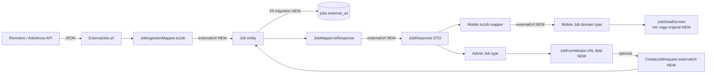

# Design: job-external-url

## Context & Scope

The external job URL is already present in the `ExternalJob` ingestion DTO (`url` component) but is silently dropped by `JobIngestionMapper.toJob()`. This spec threads a single new field — `externalUrl` — through every layer of the stack: database (Flyway V9), JPA entity, ingestion mapper, API DTO, response mapper, mobile types/mapper, mobile detail screen, and admin form. The change is mechanical plumbing with one user-facing affordance (a "Ver vaga original" link on mobile).

### Requirement Coverage

| Requirement | Covered by |
|---|---|
| 1.1, 1.2, 1.3 | V9 migration + `Job` entity + `JobIngestionMapper` |
| 2.1, 2.2 | `CreateJobRequest` + admin schema |
| 2.3, 5.3 | Admin Zod schema URL validation |
| 3.1, 3.2 | `JobResponse` + `JobMapper` |
| 4.1, 4.2, 4.3 | Mobile `Job` type + `toJob` mapper + `JobDetailScreen` |
| 5.1, 5.2 | Admin `JobFormModal` + admin `jobApi` types |
| 6.1, 6.2 | Design non-goal enforcement (no server-side fetch) |

## Boundary Commitments

**This spec owns:**
- The `external_url` column on the `jobs` table.
- The `externalUrl` field on the `Job` entity, `JobResponse` DTO, and `CreateJobRequest` DTO.
- The one-line fix in `JobIngestionMapper.toJob()` that passes `url` through.
- The optional URL field on the admin `JobFormModal`, its Zod schema, and the admin `Job`/`JobInput` types.

**This spec does NOT own:**
- Resume generation, LaTeX, tectonic, or the Resume entity (`ai-resume-generator`).
- Mobile tab renaming, PDF preview, or the apply-button replacement (`mobile-resume-experience`).
- **Mobile `externalUrl` display** — types, mappers, and the "Ver vaga original" button on `JobDetailScreen` are owned by `mobile-resume-experience` (which already reworks that screen).
- Ingestion scheduling, dedup `(source, external_id)` logic, or source connector JSON parsing.
- The full-text search index (`tsvector`) or search ranking.

**Allowed dependencies (inbound):**
- `ai-resume-generator` may READ `JobResponse.externalUrl` for LLM context; it must not require it (null is valid).

**Revalidation triggers:**
- Changing the `JobResponse` record component order requires updating `JobMapper` and both clients' mirror types simultaneously.
- Renaming the `externalUrl` column/field requires a coordinated migration across all three apps.

## Goals / Non-Goals

**Goals:**
- Every ingested job has its source URL persisted.
- The API exposes the URL (nullable).
- Mobile shows a conditional external link.
- Admin can optionally set a URL on manual jobs.

**Non-Goals:**
- No server-side fetching, proxying, or HTML preview of external URLs (untrusted content).
- No click analytics.
- No search-index changes.

## Architecture & Data Flow



The field flows in one direction (source → storage → API → clients). The only feedback path is the admin form writing back through `CreateJobRequest`.

## Data Model Changes

### Database — Flyway V9

**File:** `perfectjob-api/src/main/resources/db/migration/V9__add_job_external_url.sql`

```sql
ALTER TABLE jobs ADD COLUMN external_url VARCHAR(2048);
```

- Nullable (manually-created jobs may not have one).
- `VARCHAR(2048)` to accommodate long URLs with query parameters (per RFC 3986 practical limits).
- No unique constraint (the same URL could legitimately appear on different dedup'd records).
- No index (the URL is never a query/filter key).

### JPA Entity

**File:** `perfectjob-api/src/main/java/com/perfectjob/model/Job.java`

Add a new field alongside the existing `source` / `externalId` ingestion-tracking block (lines 117–123):

```java
@Column(name = "external_url", length = 2048)
private String externalUrl;
```

- Placed in the "External ingestion tracking" section.
- Nullable (no `nullable = false`).
- Lombok `@Data` generates the getter/setter automatically.

## Component Changes

### 1. Ingestion Mapper Fix

**File:** `perfectjob-api/src/main/java/com/perfectjob/service/ingestion/JobIngestionMapper.java`

**Change:** Add `.externalUrl(ext.url())` to the builder chain in `toJob()` (line 32–48). The `url` component is already populated by both `RemotiveJobSource` and `ArbeitnowJobSource`.

```java
.externalUrl(ext.url())
```

- Single line addition in the existing `Job.builder()` chain.
- Pure/static method — no Spring context needed for testing.

### 2. API Response DTO

**File:** `perfectjob-api/src/main/java/com/perfectjob/dto/response/JobResponse.java`

**Change:** Add `String externalUrl` as the final component of the record (after `expiresAt`). Records are positional, so adding at the end is the least disruptive.

```java
LocalDateTime expiresAt,
String externalUrl
```

### 3. API Response Mapper

**File:** `perfectjob-api/src/main/java/com/perfectjob/service/mapper/JobMapper.java`

**Change:** Pass `job.getExternalUrl()` as the final argument in the `new JobResponse(...)` constructor call (line 14–40).

```java
job.getExpiresAt(),
job.getExternalUrl()
```

### 4. Admin Job Creation Request DTO

**File:** `perfectjob-api/src/main/java/com/perfectjob/dto/request/CreateJobRequest.java`

**Change:** Add an optional URL component with Bean Validation:

```java
@Size(max = 2048) String externalUrl
```

- No `@NotBlank` (optional).
- `@Size(max = 2048)` mirrors the column length.
- Placed after `expiresAt` to match `JobResponse` ordering convention.

### 4b. Job Service Wiring

**File:** `perfectjob-api/src/main/java/com/perfectjob/service/JobService.java`

**Change:** Wire `externalUrl` from the request into the entity in both write paths:
- `create()` (line 56–74): add `.externalUrl(request.externalUrl())` to the `Job.builder()` chain.
- `update()` (line 127–140): add `job.setExternalUrl(request.externalUrl());` alongside the other setters.

## Mobile Changes

### 5. Mobile API Response Type

**File:** `perfectjob-mobile/src/types/job.ts`

**Change:** Add `externalUrl?: string | null;` as the final field of the `JobResponse` interface.

### 6. Mobile Domain Job Type

**File:** `perfectjob-mobile/src/types/index.ts`

**Change:** Add `externalUrl?: string | null;` to the `Job` interface.

### 7. Mobile Mapper

**File:** `perfectjob-mobile/src/services/api/mappers.ts`

**Change:** In `toJob()`, add `externalUrl: response.externalUrl ?? null` to the returned object (after `benefits`, line 70–71).

### 8. Mobile Job Detail Screen

**File:** `perfectjob-mobile/src/screens/job-detail/JobDetailScreen.tsx`

**Change:** Add a conditional "Ver vaga original" action. Implementation:

- Import `Linking` from `react-native`.
- Add a handler: `const handleOpenUrl = () => { if (job.externalUrl) Linking.openURL(job.externalUrl) }`.
- Render a button (using the existing `TouchableOpacity` + design-token pattern) inside the `ScrollView`, after the "Habilidades" section and before `bottomSpacer`, shown only when `job.externalUrl` is truthy.
- Label: "Ver vaga original" (pt-BR, per product copy convention).
- Icon: external-link style from the existing `Icon` component family.
- Opens via `Linking.openURL` → system browser (satisfies requirement 4.3).

```tsx
{job.externalUrl ? (
  <TouchableOpacity style={styles.externalLinkBtn} onPress={handleOpenUrl} activeOpacity={0.7}>
    <Icon family="MaterialIcons" name="open-in-new" size={18} color={colors.primary[500]} />
    <Text style={styles.externalLinkText}>Ver vaga original</Text>
  </TouchableOpacity>
) : null}
```

## Admin Changes

### 9. Admin API Types

**File:** `perfectjob-admin/src/services/api/jobApi.ts`

**Change:** Add `externalUrl?: string;` to both the `Job` interface and the `JobInput` interface.

### 10. Admin Zod Schema

**File:** `perfectjob-admin/src/schemas/job.ts`

**Change:** Add an optional URL field to `jobSchema`:

```typescript
externalUrl: z.string().url('URL inválida').or(z.literal('')).optional(),
```

- `url()` validates format (satisfies requirements 2.3, 5.3).
- `.or(z.literal(''))` allows empty string (form clearing).
- `.optional()` allows omission.

### 11. Admin Job Form

**File:** `perfectjob-admin/src/pages/JobFormModal.tsx`

**Changes:**
- `toFormInput()`: add `externalUrl: job?.externalUrl ?? ''` (and `externalUrl: ''` in the default/new-job branch).
- `toApiPayload()`: add `externalUrl: data.externalUrl || undefined` (send `undefined` so the API treats empty as "no change" on PATCH).
- Add an `<Input>` field labeled "URL da vaga (opcional)" with `type="url"`, placed after the location fields and before the Skills section. Register via `{...register('externalUrl')}` with error display.

## File Structure Plan

| # | File | Action | Responsibility |
|---|---|---|---|
| 1 | `perfectjob-api/.../db/migration/V9__add_job_external_url.sql` | Create | Add nullable `external_url VARCHAR(2048)` column |
| 2 | `perfectjob-api/.../model/Job.java` | Modify | Add `externalUrl` field to entity |
| 3 | `perfectjob-api/.../service/ingestion/JobIngestionMapper.java` | Modify | Pass `ext.url()` into builder |
| 4 | `perfectjob-api/.../dto/response/JobResponse.java` | Modify | Add `externalUrl` record component |
| 5 | `perfectjob-api/.../service/mapper/JobMapper.java` | Modify | Map `job.getExternalUrl()` into response |
| 6 | `perfectjob-api/.../dto/request/CreateJobRequest.java` | Modify | Add optional `externalUrl` with `@Size` |
| 6b | `perfectjob-api/.../service/JobService.java` | Modify | Wire `externalUrl` into create (builder) + update (setter) |
| 7 | `perfectjob-admin/src/services/api/jobApi.ts` | Modify | Add `externalUrl` to `Job` + `JobInput` |
| 8 | `perfectjob-admin/src/schemas/job.ts` | Modify | Add validated optional URL field |
| 9 | `perfectjob-admin/src/pages/JobFormModal.tsx` | Modify | Add URL input + wiring |

_Boundary:_ Items 1–6b are backend (Spring Boot); 7–9 are admin (React/Vite). **Mobile `externalUrl` plumbing and display are owned by `mobile-resume-experience`.** No file spans more than one app.

## API Contract

### `JobResponse` (response — `/api/v1/jobs/**`)

New final field:

```json
{
  "id": 42,
  "...": "...",
  "expiresAt": "2026-07-22T00:00:00",
  "externalUrl": "https://remotive.com/job/12345"
}
```

`externalUrl` is `null` for manually-created jobs without a URL.

### `CreateJobRequest` (request — `POST /api/v1/jobs`, `PATCH /api/v1/jobs/{id}`)

New optional final field:

```json
{
  "title": "...",
  "externalUrl": "https://example.com/job"
}
```

Omitting the field or sending `null` leaves the URL unset.

## Testing Strategy

### Backend (Java / Spring Boot Test + H2)

| Test | Verifies |
|---|---|
| `JobIngestionMapperTest.toJob_persistsUrl` | Requirement 1.1 — mapper passes `url` into entity |
| `JobIngestionMapperTest.toJob_nullUrl` | Entity `externalUrl` is null when source omits URL |
| `JobMapperTest.toResponse_includesExternalUrl` | Requirement 3.1, 3.2 — response includes field (null when absent) |
| `JobControllerIntegrationTest` (existing, extended) | End-to-end: GET `/v1/jobs/{slug}` returns `externalUrl`; POST `/v1/jobs` accepts optional `externalUrl` |
| Flyway V9 applies cleanly | Migration runs against existing schema without data loss |

### Mobile (Jest)

| Test | Verifies |
|---|---|
| `mappers.test.ts` — `toJob` includes `externalUrl` | Requirement 4.1 precondition |
| `JobDetailScreen` renders link when `externalUrl` present | Requirement 4.1 |
| `JobDetailScreen` hides link when `externalUrl` null | Requirement 4.2 |

### Admin (manual / existing test patterns)

| Check | Verifies |
|---|---|
| `jobSchema` accepts valid URL | Requirement 5.1 |
| `jobSchema` rejects malformed URL | Requirement 2.3, 5.3 |
| Form pre-populates URL on edit | Requirement 5.2 |

## Risks & Mitigations

| Risk | Likelihood | Mitigation |
|---|---|---|
| `JobResponse` record component reordering breaks positional constructor in `JobMapper` | Medium | Add `externalUrl` as the **last** component; update `JobMapper` in the same task |
| Mobile `toJob` return type (`Job & { slug; originalId }`) must include `externalUrl` | Low | Add field to both `Job` interface and mapper object |
| Existing ingested jobs have null URL until re-ingested | Expected | Acceptable — requirement 1.3 prevents overwriting; candidates simply don't see the link until fresh ingest |
| `Linking.openURL` fails on malformed/unreachable URL | Low | External URLs are already validated format on admin; ingested URLs come from structured API responses. No additional guarding needed for MVP. |
