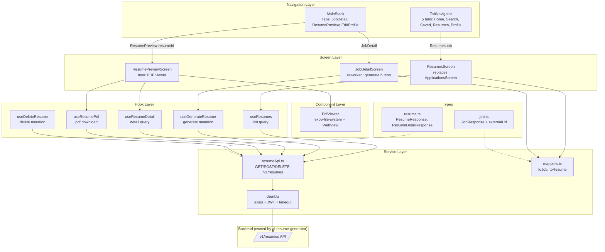
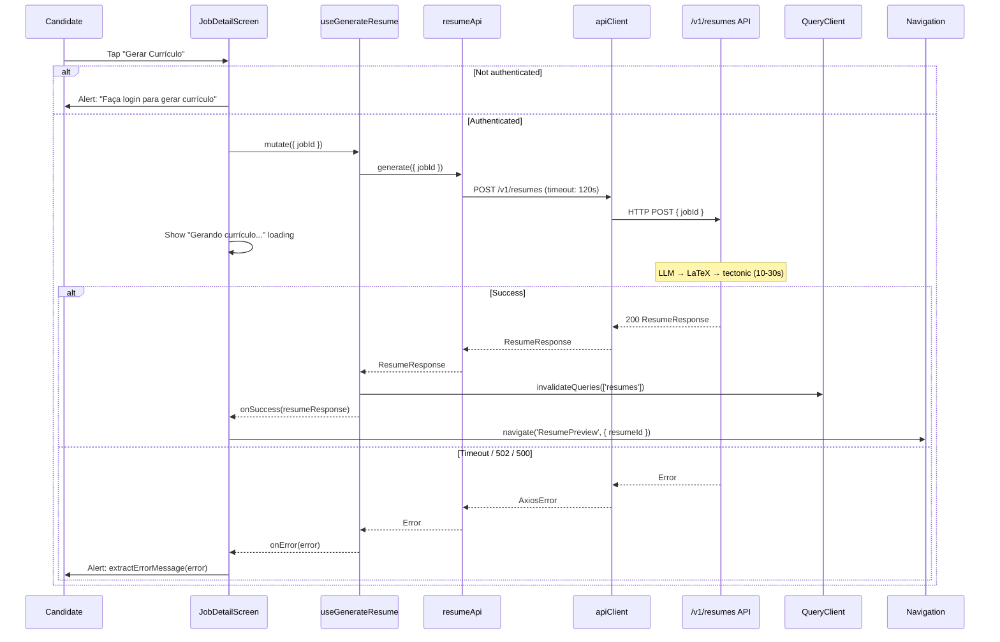
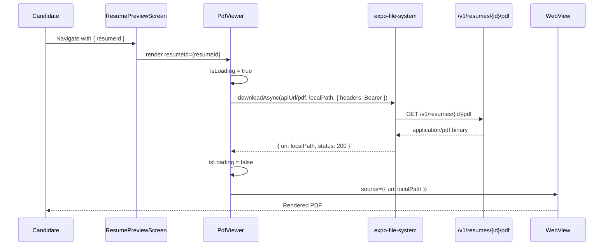
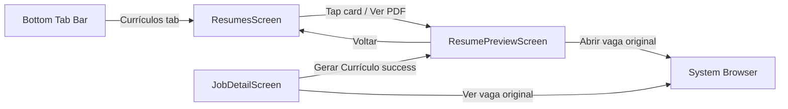

# Design Document

---
**Purpose**: Provide sufficient detail to ensure implementation consistency across different implementers, preventing interpretation drift.
---

## Overview

**Purpose**: This feature replaces the mobile app's "submit application" candidate flow with an "AI resume generation" flow. The candidate generates a job-tailored PDF resume from the job detail screen, browses their generated resumes in a renamed "Currículos" tab, and previews any resume as a PDF — all within the Expo Go runtime.

**Users**: Job candidates use the mobile app (Expo / React Native) to generate resumes, browse them, and preview the PDF output. The mobile app is a pure consumer of the `/v1/resumes` REST API defined by the `ai-resume-generator` spec.

**Impact**: Replaces the entire Application subsystem on the mobile side — the `ApplicationsScreen`, application types, application API service, and application hooks are deleted. The `JobDetailScreen` bottom button changes from "Candidatar-se" to "Gerar Currículo". A new `ResumePreviewScreen` is added. The bottom tab "Candidaturas" becomes "Currículos". The `externalUrl` field is threaded into the mobile Job type to support the "Ver vaga original" link.

### Goals
- Rename the candidate tab and replace the application list with a resume list.
- Enable resume generation from the job detail screen with a clear long-loading UX.
- Render generated PDFs within Expo Go using only compatible libraries.
- Remove all application-related code from the mobile app.
- Display the job's external URL when available.

### Non-Goals
- Resume generation backend (Spec: `ai-resume-generator`).
- Resume editing (regenerate instead).
- Offline resume persistence beyond TanStack Query cache.
- PDF annotation, sharing, or versioning.
- Admin web application changes.

## Boundary Commitments

### This Spec Owns
- All mobile-side resume UI: `ResumesScreen`, `ResumePreviewScreen`, `PdfViewer` component.
- The rework of `JobDetailScreen` (button change, generation flow, external link).
- The navigation type changes (`TabParamList`, `MainStackParamList`).
- The mobile resume TypeScript types (`ResumeResponse`, `ResumeDetailResponse`, `GenerateResumeRequest`).
- The resume API service module (`resumeApi.ts`).
- The resume TanStack Query hooks (`useResumes.ts`).
- The resume mapper (`ResumeView`, `toResume`) and removal of application mappers.
- The `externalUrl` additions to mobile `JobResponse`, domain `Job`, and `toJob` mapper.
- The addition of `expo-file-system` as a dependency.
- The deletion of all application-related mobile files.

### Out of Boundary
- Resume generation backend pipeline (LLM, LaTeX, tectonic) — Spec: `ai-resume-generator`.
- Database schema, migrations, entity definitions — backend concern.
- `JobResponse.externalUrl` backend field addition — Spec: `job-external-url`.
- `ProfileResponse.applicationsCount` removal — Spec: `ai-resume-generator` (adjacent impact only).
- Admin web application — separate build unit.
- Expo configuration changes beyond adding `expo-file-system`.

### Allowed Dependencies
- `GET/POST/DELETE /v1/resumes` endpoints (owned by `ai-resume-generator` spec).
- `GET /v1/resumes/{id}/pdf` binary endpoint.
- `GET /v1/jobs/{slug}` endpoint (existing, for job detail).
- Existing `apiClient` (axios instance) from `src/services/api/client.ts`.
- Existing `extractErrorMessage` helper from `src/services/api/client.ts`.
- `expo-file-system` (new dependency, Expo Go compatible).
- `react-native-webview` (bundled with Expo SDK 54, Expo Go compatible).
- `Linking` from `react-native` (for external URL opening).
- Existing design tokens (`colors`, `typography`, `spacing`).
- `@tanstack/react-query` 5.x (existing).

### Revalidation Triggers
- `ResumeResponse` or `ResumeDetailResponse` field changes → mobile types must be revalidated.
- `GenerateResumeRequest` shape change → mobile request type must be revalidated.
- `JobResponse` field reordering → mobile `toJob` mapper must be rechecked.
- API endpoint path changes (`/v1/resumes`) → `resumeApi.ts` must be rechecked.
- PDF content-type or streaming approach change → `PdfViewer` download strategy must be rechecked.

## Architecture

### Existing Architecture Analysis

The mobile app follows a feature-folder structure under `src/`:
- **Navigation**: `RootNavigator` → `AuthNavigator` (unauthenticated) / `MainNavigator` (authenticated). `MainNavigator` combines a bottom `TabNavigator` (5 tabs) with a native stack for `JobDetail` and `EditProfile`.
- **Screens**: One folder per feature (`home/`, `search/`, `saved-jobs/`, `applications/`, `job-detail/`, `profile/`, `auth/`). Screens consume hooks, never call axios directly.
- **Services**: `api/client.ts` (shared axios instance with JWT interceptor), per-feature API modules (`jobApi.ts`, `savedJobApi.ts`, `applicationApi.ts`), and `mappers.ts` (API response → domain view model).
- **Hooks**: `useXxx` wrappers around TanStack Query. Queries use `useInfiniteQuery` (paginated lists) or `useQuery` (single resource). Mutations use `useMutation` with cache invalidation.
- **Types**: Mirror types for API responses (`job.ts`, `application.ts`, `page.ts`) and domain types (`index.ts`).
- **Config**: `env.ts` reads `API_URL` from `expo-constants`.

**Key constraint**: The axios client has a 10-second default timeout (`timeout: 10000`). Resume generation takes 10-30 seconds server-side. This requires a per-request timeout override.

**Key constraint**: The project runs `npx expo start --offline` with Expo Go. Native modules that require a dev client build (like `react-native-pdf`) cannot be used without breaking the developer workflow.

### Architecture Pattern & Boundary Map



**Architecture Integration**:
- Selected pattern: Feature-folder with hook-mediated data access (same as existing `jobs`, `saved-jobs` features).
- Domain boundary: Resume data flows through `resumeApi.ts` → hooks → screens. No screen calls axios directly.
- Existing patterns preserved: `useInfiniteQuery` for paginated lists, `useQuery` for single resources, `useMutation` + cache invalidation for writes, `extractErrorMessage` for error display, design tokens for all colors.
- New components: `PdfViewer` (encapsulates the file-system + WebView rendering strategy), `ResumePreviewScreen` (consumes `PdfViewer`).

### Technology Stack

| Layer | Choice / Version | Role in Feature | Notes |
|-------|------------------|-----------------|-------|
| Mobile / UI | React Native 0.81.5 + Expo SDK 54 + React 19.1 | All screens and components | Existing stack, unchanged |
| Server State | @tanstack/react-query 5.x | Resume list/generation/detail queries | Existing, follows `useJobs` / `useSavedJobs` patterns |
| HTTP Client | axios 1.7 | API calls via `apiClient` | Existing; generation request needs 120s per-request timeout |
| PDF Download | expo-filesystem ~18.0 (new dep) | Download PDF binary to local file | Expo Go compatible; supports auth headers |
| PDF Render | react-native-webview (bundled with Expo SDK 54) | Render local PDF file in WebView | Expo Go compatible; no native module build |
| Navigation | @react-navigation/{native-stack,bottom-tabs} 7.x | Tab rename + new stack route | Existing |
| Icons | @expo/vector-icons | Tab icons, external-link icon, back button | Existing |

## PDF Rendering Strategy

### Decision: expo-file-system + WebView

**Chosen approach**: Download the PDF binary via `expo-file-system`'s `FileSystem.downloadAsync()` (with the JWT Bearer token in headers) to the app's document directory, then render the local file URI in a `<WebView>`.

**Rationale**:
- The project runs `npx expo start --offline` with **Expo Go** (not an Expo dev client). `react-native-pdf` is a native module that requires `npx expo prebuild` and a custom dev client build — it does **not** work in Expo Go. Adopting it would break the current developer workflow.
- `expo-file-system` is an official Expo module that works in Expo Go out of the box. It needs to be added to `package.json`.
- `react-native-webview` ships with Expo SDK 54 and works in Expo Go. iOS WKWebView renders PDFs natively. Android WebView (Chrome-based) renders PDFs on modern devices.
- The download approach with `FileSystem.downloadAsync` supports custom headers (needed for the JWT Bearer token), which a plain `<WebView source={{ uri: apiUrl }}>` cannot provide.

**Rejected alternatives**:
| Approach | Verdict | Reason |
|----------|---------|--------|
| `react-native-pdf` | Rejected | Native module → requires Expo dev client build → breaks Expo Go `--offline` workflow |
| Base64 data URI in WebView | Rejected | Large memory overhead, slow for multi-page PDFs, encoding complexity |
| `Linking.openURL` (system viewer) | Fallback only | Leaves the app context; used only if WebView fails |
| `expo-sharing` (open in another app) | Fallback only | Leaves the app; not a preview experience |

**Fallback**: If the WebView cannot render the PDF (rare on modern devices), the `PdfViewer` component offers an "Abrir em outro aplicativo" button that calls `Linking.openURL` with the local file URI or uses `expo-sharing` to open it in an external PDF reader.

**Encapsulation**: All PDF rendering logic lives behind the `PdfViewer` component (`src/components/shared/PdfViewer.tsx`). The `ResumePreviewScreen` passes a `resumeId` and the component handles download + render internally. This allows swapping the rendering library in the future (e.g., to `react-native-pdf` if the project migrates to a dev client) without modifying any screen.

## File Structure Plan

### Directory Structure
```
perfectjob-mobile/src/
├── types/
│   ├── resume.ts                        # NEW: ResumeResponse, ResumeDetailResponse, GenerateResumeRequest
│   ├── job.ts                           # MODIFY: add externalUrl to JobResponse
│   └── index.ts                         # MODIFY: add externalUrl to Job domain type
├── services/api/
│   ├── resumeApi.ts                     # NEW: list, generate, getDetail, getPdfUri, delete
│   ├── mappers.ts                       # MODIFY: add toResume + ResumeView; remove toApplication + ApplicationView + applicationStatusConfig
│   ├── client.ts                        # EXISTING: no change (per-request timeout used inline)
│   └── __tests__/
│       └── mappers.test.ts              # MODIFY: add toResume tests; update baseResponse with externalUrl
├── hooks/
│   └── useResumes.ts                    # NEW: useResumes, useGenerateResume, useResumeDetail, useDeleteResume
├── screens/
│   ├── resumes/                         # NEW: replaces applications/
│   │   └── ResumesScreen.tsx            # NEW: list of generated resumes
│   ├── resume-preview/                  # NEW
│   │   └── ResumePreviewScreen.tsx      # NEW: PDF viewer + external link + back
│   └── job-detail/
│       └── JobDetailScreen.tsx          # MODIFY: button change, generation flow, external link
├── components/shared/
│   └── PdfViewer.tsx                    # NEW: expo-file-system download + WebView render
├── navigation/
│   └── MainNavigator.tsx                # MODIFY: rename tab, add ResumePreview route
└── config/
    └── env.ts                           # EXISTING: no change
```

### Deleted Files
- `src/types/application.ts` — replaced by `resume.ts`
- `src/services/api/applicationApi.ts` — replaced by `resumeApi.ts`
- `src/hooks/useApplications.ts` — replaced by `useResumes.ts`
- `src/screens/applications/ApplicationsScreen.tsx` — replaced by `screens/resumes/ResumesScreen.tsx`
- `src/screens/applications/` directory — removed entirely

### Modified Files
- `src/types/job.ts` — Add `externalUrl?: string | null;` as the final field of `JobResponse`.
- `src/types/index.ts` — Add `externalUrl?: string | null;` to the `Job` interface.
- `src/services/api/mappers.ts` — Add `externalUrl` pass-through in `toJob()`; add `ResumeView` interface and `toResume()` function; remove `ApplicationView`, `toApplication()`, `applicationStatusConfig`, and the `ApplicationResponse`/`ApplicationStatus` imports.
- `src/services/api/__tests__/mappers.test.ts` — Add `externalUrl` to `baseResponse`; add `toResume` test suite; remove any `toApplication` tests if present.
- `src/screens/job-detail/JobDetailScreen.tsx` — Replace `useSubmitApplication` with `useGenerateResume`; change button label to "Gerar Currículo"; add 120s timeout; navigate to `ResumePreview` on success; add "Ver vaga original" link when `job.externalUrl` is present; remove the confirmation `Alert.alert` (generation is intentional, not destructive).
- `src/navigation/MainNavigator.tsx` — Rename `Applications` → `Resumes` in `TabParamList`; update `TAB_ICONS` key; change tab label to "Currículos"; swap component import; add `ResumePreview: { resumeId: number }` to `MainStackParamList`; register `ResumePreviewScreen` in the stack.
- `package.json` — Add `expo-file-system` dependency (`"expo-file-system": "~18.0.0"`).

## System Flows

### Resume Generation Flow



### Resume Preview / PDF Rendering Flow



### Tab Navigation Flow



## Requirements Traceability

| Requirement | Summary | Components | Interfaces | Flows |
|-------------|---------|------------|------------|-------|
| 1.1–1.5 | Tab rename | MainNavigator, TabParamList | TabNavigator | Tab Navigation |
| 2.1–2.8 | Resumes list | ResumesScreen, useResumes, resumeApi, toResume | GET /v1/resumes | List browsing |
| 3.1–3.7 | Generation from job detail | JobDetailScreen, useGenerateResume, resumeApi | POST /v1/resumes | Generation |
| 4.1–4.7 | PDF preview | ResumePreviewScreen, PdfViewer, resumeApi | GET /v1/resumes/{id}/pdf | PDF Rendering |
| 5.1–5.4 | External URL display | JobDetailScreen, Job type, toJob mapper | JobResponse.externalUrl | External link |
| 6.1–6.9 | Data layer | resume.ts, resumeApi.ts, useResumes.ts, mappers.ts | All /v1/resumes endpoints | All flows |
| 7.1–7.8 | Application removal | (deleted files), mappers.ts, MainNavigator | — | Cleanup |
| 8.1–8.7 | Loading/error/empty | JobDetailScreen, ResumesScreen, ResumePreviewScreen | extractErrorMessage | All flows |

## Components and Interfaces

### Types Layer

#### `types/resume.ts` (NEW)

| Field | Detail |
|-------|--------|
| Intent | Mirror the `/v1/resumes` API response shapes |
| Requirements | 6.1, 6.2, 6.3 |

```typescript
export interface GenerateResumeRequest {
  jobId: number;
}

export interface ResumeResponse {
  id: number;
  jobId: number;
  jobTitle: string;
  pdfStoragePath: string;
  createdAt: string;
  updatedAt: string;
}

export interface ResumeDetailResponse {
  id: number;
  jobId: number;
  jobTitle: string;
  jobDescription: string;
  pdfStoragePath: string;
  latexSource: string;
  createdAt: string;
  updatedAt: string;
}
```

These mirror the Java records from the `ai-resume-generator` spec exactly: `ResumeResponse(Long, Long, String, String, LocalDateTime, LocalDateTime)` and `ResumeDetailResponse(Long, Long, String, String, String, String, LocalDateTime, LocalDateTime)`.

---

### Service Layer

#### `services/api/resumeApi.ts` (NEW)

| Field | Detail |
|-------|--------|
| Intent | API client for all `/v1/resumes` endpoints |
| Requirements | 6.4 |

**Service Interface**:
```typescript
export const resumeApi = {
  list: (page = 0, size = 20) => Promise<PageResponse<ResumeResponse>>;
  generate: (data: GenerateResumeRequest) => Promise<ResumeResponse>;
  getDetail: (id: number) => Promise<ResumeDetailResponse>;
  getPdfUri: (id: number) => Promise<string>;    // downloads to local file, returns local URI
  delete: (id: number) => Promise<void>;
};
```

**Implementation Notes**:
- `list`: `GET /v1/resumes?page=${page}&size=${size}` — returns `PageResponse<ResumeResponse>`.
- `generate`: `POST /v1/resumes` with body `{ jobId }` — **critical**: uses per-request timeout override `apiClient.post(url, data, { timeout: 120000 })` because the default client timeout is 10s but generation takes 10-30s.
- `getDetail`: `GET /v1/resumes/${id}` — returns `ResumeDetailResponse`.
- `getPdfUri`: Uses `FileSystem.downloadAsync()` from `expo-file-system`. Reads the JWT from `expo-secure-store`, constructs the full URL from `ENV.API_URL`, downloads to `FileSystem.documentDirectory + 'resume-{id}.pdf'`, and returns the local file URI. This avoids axios binary-handling complexity and supports auth headers natively.
- `delete`: `DELETE /v1/resumes/${id}` — returns void.

**Dependencies**:
- Outbound: `apiClient` (axios) from `./client.ts`.
- Outbound: `FileSystem` from `expo-file-system` (for PDF download).
- Outbound: `SecureStore` from `expo-secure-store` (for JWT in download headers).
- Outbound: `ENV.API_URL` from `@/config/env`.

---

#### `services/api/mappers.ts` (MODIFIED)

| Field | Detail |
|-------|--------|
| Intent | Transform API responses into view models for screens |
| Requirements | 6.9, 2.2, 7.5, 7.6 |

**Changes**:

Add `externalUrl` to `toJob()`:
```typescript
export function toJob(response: JobResponse): Job & { slug: string; originalId: number } {
  // ... existing mapping ...
  return {
    // ... existing fields ...
    externalUrl: response.externalUrl ?? null,
  };
}
```

Add `ResumeView` and `toResume()`:
```typescript
export interface ResumeView {
  id: number;
  jobId: number;
  jobTitle: string;
  createdAt: string;
  createdAtLabel: string;    // formatted pt-BR date
}

export function toResume(response: ResumeResponse): ResumeView {
  return {
    id: response.id,
    jobId: response.jobId,
    jobTitle: response.jobTitle,
    createdAt: response.createdAt,
    createdAtLabel: new Date(response.createdAt).toLocaleDateString('pt-BR'),
  };
}
```

Remove: `ApplicationView`, `toApplication()`, `applicationStatusConfig`, and the `ApplicationResponse`/`ApplicationStatus` imports.

**Note on company name**: The `ResumeResponse` from the API does not include a company name field. The `ResumeView` card therefore displays the job title and generation date only. If the API is later extended to include `companyName`, the mapper and card can be updated without breaking the screen contract.

---

### Hook Layer

#### `hooks/useResumes.ts` (NEW)

| Field | Detail |
|-------|--------|
| Intent | TanStack Query hooks for resume list, generation, detail, and deletion |
| Requirements | 6.5, 6.6, 6.7, 6.8 |

```typescript
// Paginated list — follows useMyApplications / useSavedJobs pattern
export function useResumes() {
  return useInfiniteQuery({
    queryKey: ['resumes', 'list'],
    queryFn: ({ pageParam = 0 }) => resumeApi.list(pageParam),
    getNextPageParam: (last) => last.number < last.totalPages - 1 ? last.number + 1 : undefined,
    initialPageParam: 0,
  });
}

// Generation mutation — invalidates list on success
export function useGenerateResume() {
  const queryClient = useQueryClient();
  return useMutation({
    mutationFn: (req: GenerateResumeRequest) => resumeApi.generate(req),
    onSuccess: () => {
      queryClient.invalidateQueries({ queryKey: ['resumes'] });
    },
  });
}

// Single resume detail
export function useResumeDetail(resumeId: number) {
  return useQuery({
    queryKey: ['resumes', 'detail', resumeId],
    queryFn: () => resumeApi.getDetail(resumeId),
    enabled: !!resumeId,
  });
}

// Delete mutation — invalidates list on success
export function useDeleteResume() {
  const queryClient = useQueryClient();
  return useMutation({
    mutationFn: (id: number) => resumeApi.delete(id),
    onSuccess: () => {
      queryClient.invalidateQueries({ queryKey: ['resumes'] });
    },
  });
}
```

**Query key conventions**:
- `['resumes', 'list']` — paginated list (matches `['applications', 'me']` pattern).
- `['resumes', 'detail', resumeId]` — single detail (matches `['jobs', 'detail', slug]` pattern).
- Invalidation uses `['resumes']` namespace prefix to catch both list and detail.

---

### Screen Layer

#### `screens/resumes/ResumesScreen.tsx` (NEW — replaces ApplicationsScreen)

| Field | Detail |
|-------|--------|
| Intent | List generated resumes with PDF preview navigation |
| Requirements | 2.1–2.8 |

**Structure** (mirrors ApplicationsScreen architecture):
- `SafeAreaView` with header "Meus Currículos".
- `FlatList` with infinite scroll (`useResumes` infinite query), pull-to-refresh, loading footer.
- Each card: job title (semibold), "Gerado em {date}" (caption), "Ver PDF" button (accent or primary token).
- Empty state: icon + "Nenhum currículo gerado" + guidance text.
- Error state: "Não foi possível carregar" + "Tentar novamente" button.
- Card tap / "Ver PDF" → `navigation.navigate('ResumePreview', { resumeId: item.id })`.

**Implementation Notes**:
- Uses `toResume()` mapper to convert `ResumeResponse` → `ResumeView`.
- "Ver PDF" button styled with `colors.primary[500]` background, white text, rounded corners.
- Pagination via `onEndReached` + `fetchNextPage` (same as ApplicationsScreen).

---

#### `screens/job-detail/JobDetailScreen.tsx` (MODIFIED)

| Field | Detail |
|-------|--------|
| Intent | Replace apply button with generate; add external link |
| Requirements | 3.1–3.7, 5.1–5.4 |

**Changes from current implementation**:

1. **Import swap**: Replace `useSubmitApplication` from `@/hooks/useApplications` with `useGenerateResume` from `@/hooks/useResumes`.

2. **Button label**: Change `applyBtnText` from "Candidatar-se" to "Gerar Currículo".

3. **`handleApply` → `handleGenerate`**: Remove the `Alert.alert` confirmation dialog (generation is not destructive; the loading state provides the affordance to wait). Replace with direct mutation call:
   ```typescript
   const generateResume = useGenerateResume();

   const handleGenerate = () => {
     if (!isAuthenticated) {
       Alert.alert('Login necessário', 'Faça login para gerar um currículo.', [
         { text: 'Cancelar', style: 'cancel' },
         { text: 'Login', onPress: () => navigation.dispatch(CommonActions.navigate({ name: 'Auth', params: { screen: 'Login' } })) },
       ]);
       return;
     }
     if (!job || jobId === null) return;
     generateResume.mutate(
       { jobId },
       {
         onSuccess: (resume) => navigation.navigate('ResumePreview', { resumeId: resume.id }),
         onError: (error) => Alert.alert('Erro', extractErrorMessage(error)),
       }
     );
   };
   ```

4. **Loading text**: When `generateResume.isPending`, show `<ActivityIndicator>` + "Gerando currículo..." text instead of just the spinner.

5. **Button style**: Use `colors.primary[500]` token (replace hardcoded `'#2B5FC2'` in `applyBtn` style).

6. **External link**: Add "Ver vaga original" button after the skills section, visible only when `job.externalUrl` is truthy:
   ```tsx
   {job.externalUrl ? (
     <TouchableOpacity style={styles.externalLinkBtn} onPress={() => Linking.openURL(job.externalUrl!)} activeOpacity={0.7}>
       <Icon family="MaterialIcons" name="open-in-new" size={18} color={colors.primary[500]} />
       <Text style={styles.externalLinkText}>Ver vaga original</Text>
     </TouchableOpacity>
   ) : null}
   ```

7. **Accessibility label**: Change from "Candidatar-se a esta vaga" to "Gerar currículo para esta vaga".

8. **`disabled` and `isPending`**: Replace `submitApplication.isPending` with `generateResume.isPending`.

---

#### `screens/resume-preview/ResumePreviewScreen.tsx` (NEW)

| Field | Detail |
|-------|--------|
| Intent | Render the generated PDF with navigation controls |
| Requirements | 4.1–4.7, 8.6 |

**Structure**:
- `SafeAreaView` with header: back button ("Voltar") + title "Currículo".
- `PdfViewer` component fills the remaining space, receiving `resumeId` as prop.
- Loading overlay while PDF downloads: spinner + "Carregando currículo...".
- Error state: "Não foi possível carregar o currículo" + "Tentar novamente".
- Optional "Abrir em outro aplicativo" fallback button (calls `Linking.openURL` with the local file URI if WebView rendering fails).

**Route params**: `{ resumeId: number }` from `MainStackParamList['ResumePreview']`.

**Implementation Notes**:
- Uses `useRoute<RouteProp<MainStackParamList, 'ResumePreview'>>()` to read `resumeId`.
- Delegates all PDF logic to `PdfViewer`.

---

### Component Layer

#### `components/shared/PdfViewer.tsx` (NEW)

| Field | Detail |
|-------|--------|
| Intent | Encapsulate PDF download + rendering behind a reusable component |
| Requirements | 4.2, 4.6, 4.7 |

**Props**:
```typescript
interface PdfViewerProps {
  resumeId: number;
  onError?: (error: unknown) => void;
}
```

**Internal state machine**: `idle → downloading → ready → error`.

**Implementation**:
1. On mount/resumeId change, call `resumeApi.getPdfUri(resumeId)` which uses `FileSystem.downloadAsync` with auth headers.
2. On success, set local URI state → render `<WebView source={{ uri: localUri }} style={{ flex: 1 }} />`.
3. On failure, render error state with retry callback.
4. While downloading, render loading spinner.

**Why a component**: The PDF rendering strategy (expo-file-system + WebView) is an implementation detail. Screens should not know about `FileSystem`, `WebView`, or file URIs. If the project later migrates to `react-native-pdf` or a dev client, only `PdfViewer` changes.

---

### Navigation Layer

#### `navigation/MainNavigator.tsx` (MODIFIED)

| Field | Detail |
|-------|--------|
| Intent | Rename tab and add preview route |
| Requirements | 1.1–1.5, 4.1 |

**Type changes**:
```typescript
export type MainStackParamList = {
  Tabs: undefined;
  JobDetail: { slug: string };
  ResumePreview: { resumeId: number };   // NEW
  EditProfile: undefined;
};

export type TabParamList = {
  Home: undefined;
  Search: { query?: string; category?: string } | undefined;
  Saved: undefined;
  Resumes: undefined;                     // RENAMED from Applications
  Profile: undefined;
};
```

**TAB_ICONS update**: Change key `Applications` → `Resumes` (icon pair unchanged: `['document-text', 'document-text-outline']`).

**Tab registration**: Change `<Tab.Screen name="Applications" component={ApplicationsScreen} options={{ tabBarLabel: 'Candidaturas' }} />` to `<Tab.Screen name="Resumes" component={ResumesScreen} options={{ tabBarLabel: 'Currículos' }} />`.

**Stack registration**: Add `<Stack.Screen name="ResumePreview" component={ResumePreviewScreen} options={{ headerShown: false }} />`.

**Imports**: Replace `ApplicationsScreen` import with `ResumesScreen` from `@/screens/resumes/ResumesScreen`; add `ResumePreviewScreen` from `@/screens/resume-preview/ResumePreviewScreen`.

## Data Models

### Type Alignments

All mobile types mirror the upstream API contracts defined in the `ai-resume-generator` spec's design.md.

| Mobile Type | API Source | Fields |
|-------------|-----------|--------|
| `GenerateResumeRequest` | Java record `GenerateResumeRequest` | `jobId: number` |
| `ResumeResponse` | Java record `ResumeResponse` | `id, jobId, jobTitle, pdfStoragePath, createdAt, updatedAt` |
| `ResumeDetailResponse` | Java record `ResumeDetailResponse` | `id, jobId, jobTitle, jobDescription, pdfStoragePath, latexSource, createdAt, updatedAt` |
| `JobResponse.externalUrl` | `job-external-url` spec | `externalUrl?: string \| null` |

### View Models (mobile-only)

| View Model | Source Type | Purpose |
|-----------|-------------|---------|
| `ResumeView` | `ResumeResponse` | Card display fields: id, jobId, jobTitle, createdAt, createdAtLabel |
| `Job` (extended) | `JobResponse` | Adds `externalUrl` to domain type |

## Error Handling

### Error Strategy

All API errors flow through the existing `extractErrorMessage()` helper in `client.ts`, which maps HTTP statuses and network conditions to pt-BR messages. The `resumeApi.generate()` call uses a 120-second per-request timeout; if exceeded, axios throws `ECONNABORTED` which `extractErrorMessage` maps to "O servidor demorou para responder. Tente novamente."

### Error Categories and Responses

| Scenario | HTTP Status / Condition | User-Facing Message (pt-BR) | Recovery |
|----------|------------------------|------------------------------|----------|
| Job not found | 404 | "Recurso não encontrado." | Navigate back |
| AI service unavailable | 502 | "AI service temporarily unavailable" (from API body) or status fallback | Retry button |
| Generation failed (LLM/PDF) | 500 | Error excerpt from API body via `extractErrorMessage` | Retry button |
| Request timeout (>120s) | ECONNABORTED | "O servidor demorou para responder. Tente novamente." | Retry |
| Network error | ERR_NETWORK | "Sem conexão com o servidor. Verifique sua internet." | Retry |
| PDF not found on disk | 404 | "Não foi possível carregar o currículo" | Back button |
| PDF download failure | Any | "Não foi possível carregar o currículo" + "Tentar novamente" | Retry |

### Timeout Handling

The generation endpoint is the only call that exceeds the default 10s axios timeout. The per-request override `{ timeout: 120000 }` in `resumeApi.generate()` aligns with the backend tectonic compilation timeout (120s default per `ai-resume-generator` spec requirement 4.3). No global client change is needed.

## Testing Strategy

### Unit Tests

| Test | Verifies | Requirement |
|------|----------|-------------|
| `toResume` maps `ResumeResponse` to `ResumeView` with pt-BR date label | Mapper correctness | 6.4, 2.2 |
| `toResume` handles edge dates | Date formatting | 2.2 |
| `toJob` includes `externalUrl` when present | External URL plumbing | 6.9, 5.1 |
| `toJob` sets `externalUrl` to null when absent | External URL null handling | 5.2 |
| `resumeApi` methods call correct endpoints with correct params | Service layer | 6.4 |
| `resumeApi.generate` uses 120s timeout | Long-running operation | 3.7 |

### Component / Hook Tests

| Test | Verifies | Requirement |
|------|----------|-------------|
| `useResumes` returns paginated data via infinite query | Hook pattern | 6.5 |
| `useGenerateResume` invalidates `['resumes']` on success | Cache invalidation | 6.6 |
| `PdfViewer` shows loading state while downloading | Component state | 4.3 |
| `PdfViewer` shows error state on download failure | Component error | 4.4 |

### Screen / Integration Tests

| Test | Verifies | Requirement |
|------|----------|-------------|
| `ResumesScreen` renders list of resume cards | List rendering | 2.1, 2.2 |
| `ResumesScreen` shows empty state "Nenhum currículo gerado" when list is empty | Empty state | 2.4 |
| `ResumesScreen` shows error state with retry when fetch fails | Error state | 2.6 |
| `JobDetailScreen` shows "Gerar Currículo" button | Button label | 3.1 |
| `JobDetailScreen` shows "Gerando currículo..." during pending mutation | Loading UX | 3.4 |
| `JobDetailScreen` shows "Ver vaga original" when `externalUrl` present | External link | 5.1 |
| `JobDetailScreen` hides "Ver vaga original" when `externalUrl` null | External link | 5.2 |
| `ResumePreviewScreen` renders `PdfViewer` with resumeId | Preview rendering | 4.1, 4.2 |

### Build Verification

| Check | Verifies | Requirement |
|-------|----------|-------------|
| `npm run lint` passes with zero application references | No dead imports | 7.7, 7.8 |
| TypeScript compiles with no errors after application removal | Type safety | 7.8 |
| No file imports from deleted modules | Clean removal | 7.7 |
